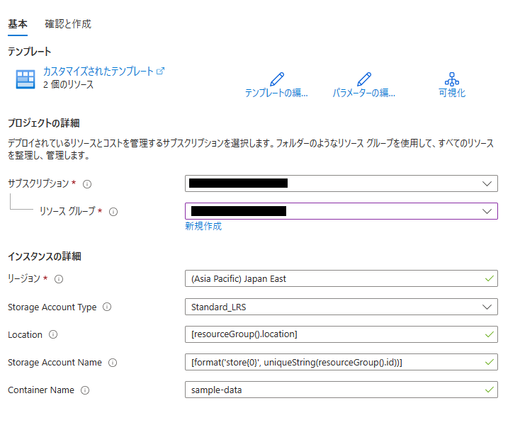

# 演習 - Azure Data Factory のマッピング データ フローを作成する

この演習では、Azure Data Factory ユーザー インターフェイス (UX) を使い、マッピング データ フローを使用して Azure Blob Storage ソースから Azure Data Lake Storage (ADLS) Gen2 シンクにデータをコピーして変換するパイプラインを作成します。 この演習の構成パターンは、マッピング データ フローを使用してデータを変換するときに拡張することができます。

> **Warning**
> 
> この演習では、データ フローをマップすることを目的としています。 データ フローは、Azure Data Factory および Synapse パイプラインの両方で使用できます。 Azure Synapse パイプラインのデータ フローを初めて使用する場合は、[Azure Synapse パイプラインを使用したデータ フロー](https://learn.microsoft.com/ja-jp/azure/synapse-analytics/concepts-data-flow-overview)に関するページに従ってください

 この演習では、次の手順を実行します。

- Data Flow アクティビティを含むパイプラインを作成します。
- 4 つの変換を使用して、マッピング データ フローを構築します。
- パイプラインをテスト実行します。
- Data Flow アクティビティを監視します。

<div>
<br>
</div>

## 事前準備

Azure Data Lake Storage Gen2 をシンクのデータストアとして使用します。下のボタンをクリックして ADLS Gen2 を作成してください。

[](https://portal.azure.com/#create/Microsoft.Template/uri/https%3A%2F%2Fraw.githubusercontent.com%2Fyasmori9%2FAzureBasicHandsonDW%2Fmain%2Fsource%2Fazuredeploy.json)

テンプレートをデプロイするために、次のようなページにリダイレクトされます。ここで前の演習で作成した**リソースグループ**を選択してください。（その他の値は全て既定値のままで問題ありません。）次に、**[確認と作成]** をクリックし、**[作成]** をクリックしてリソースをデプロイします。



## Data Flow アクティビティを含むパイプラインの作成

この手順では、Data Flow アクティビティを含むパイプラインを作成します。

1. Azure Data Factory のホーム ページで、 **[統制]** を選択します。
   
   

2. パイプラインの **[全般]** タブで、パイプラインの**名前**として「**TransformMovies**」と入力します。

3. **[アクティビティ]** ウィンドウで、 **[移動と変換]** アコーディオンを展開します。 ウィンドウから **データフロー** アクティビティをパイプライン キャンバスにドラッグ アンド ドロップします。
   
   

4. パイプライン キャンバスの上部のバーで、 **[データフロー のデバッグ]** スライダーをオンにスライドします。 デバッグ モードを使用すると、ライブ Spark クラスターに対する変換ロジックの対話型テストが可能になります。 Data Flow クラスターのウォームアップには 5 から 7 分かかるため、ユーザーが Data Flow の開発を計画している場合は、最初にデバッグを有効にすることをお勧めします。 詳細については、[デバッグ モード](https://learn.microsoft.com/ja-jp/azure/data-factory/concepts-data-flow-debug-mode)に関するページを参照してください。
   
   

## データ フロー キャンバスでの変換ロジックの作成

この手順では、Azure Blob ストレージ内の moviesDB.csv を取得し、1910 年から 2000 年までのコメディの平均評価を集計するデータ フローを作成します。 次に、このファイルを ADLS ストレージに書き戻します。

1. キャンバスの下のパネルで **[設定]** に移動し、データ フロー フィールドの横にある **[新規]** を選択します。 これにより、データフロー キャンバスが開きます。
   
   

2. データ フロー キャンバスで **[ソースの追加]** ボックスをクリックして、ソースを追加します。
   
   ![[変換元の追加] ボックスを示すスクリーンショット。](https://learn.microsoft.com/ja-jp/azure/data-factory/media/tutorial-data-flow/dataflow2.png)

3. ソースに **MoviesDB** という名前を付けます。 **[新規]** をクリックして、新しいソース データセットを作成します。
   
   ![変換元の名前を指定した後で [新規] を選択する場所を示すスクリーンショット。](https://learn.microsoft.com/ja-jp/azure/data-factory/media/tutorial-data-flow/dataflow3.png)

4. **[Azure Blob ストレージ]** を選択します。 [続行] をクリックして続行します。
   
   

5. **[DelimitedText]** を選択します。 [続行] をクリックして続行します。
   
   

6. データセットに **MoviesDB** という名前を付けます。 リンクサービスのドロップダウンで、 **[新規]** を選択します。
   
   ![[リンクされたサービス] ドロップダウン リストを示すスクリーンショット。](https://learn.microsoft.com/ja-jp/azure/data-factory/media/tutorial-data-flow/dataset3.png)

7. 新しいリンクサービスの作成画面で、以下の値を設定します。
   
   | 項目           | 設定値                                                             |
   | ------------ |:--------------------------------------------------------------- |
   | 名前           | AzureBlobStorage                                                |
   | 統合ランタイム経由で接続 | AutoResolveIntegrationRuntime                                   |
   | 認証の種類        | 匿名                                                              |
   | アカウントの選択方法   | 手動で入力                                                           |
   | コンテナーURI     | https://basichandsondwstorage.blob.core.windows.net/container1/ |
   
   

8. **[テスト接続]** をクリックすると、正しく接続できることを確認できます。 完了したら [作成] をクリックします。

9. データセットの作成画面に戻ったら、 **[ファイル パス]** フィールドの下でファイルが配置されている場所を入力します。 この演習では、moviesDB.csv ファイルはコンテナー container1 に配置されています。 ファイルにはヘッダーが含まれているため、 **[先頭行をヘッダーとして]** をオンにします。 ストレージ内のファイルからヘッダー スキーマを直接インポートするには、 **[接続またはストアから]** を選択します。 完了したら、[OK] をクリックします。
   
   

10. デバッグ クラスターが起動している場合は、ソース変換の **[データのプレビュー]** タブに移動し、 **[更新]** をクリックして、データのスナップショットを取得します。 データ プレビューを使用すると、変換が正しく構成されていることを確認できます。
    
    

11. データ フロー キャンバスでソース ノードの横にあるプラス アイコンをクリックして、新しい変換を追加します。 最初に追加する変換は、**フィルター**です。
    
    

12. フィルター変換に **FilterYears** という名前を付けます。 **[フィルター オン]** の横にある式ボックスをクリックして、式ビルダーを開きます。 ここでフィルター条件を指定します。
    
    ![[フィルター適用] 式ボックスを示すスクリーンショット。](https://learn.microsoft.com/ja-jp/azure/data-factory/media/tutorial-data-flow/filter1.png)

13. データ フローの式ビルダーでは、さまざまな変換で使用する式を対話形式で作成できます。 式には、組み込み関数、入力スキーマの列、ユーザー定義のパラメーターを含めることができます。 式の作成方法の詳細については、[Data Flow の式ビルダー](https://learn.microsoft.com/ja-jp/azure/data-factory/concepts-data-flow-expression-builder)に関するページを参照してください。
    
    このチュートリアルでは、1910 年から 2000 年の間に公開された、ジャンルがコメディの映画をフィルター処理します。 現在、年は文字列になっているため、`toInteger()` 関数を使用して整数に変換する必要があります。 以上演算子 (>=) と以下演算子 (<=) を使用して、年のリテラル値 1910 と 2000 に対する比較を行います。 これらの式を and (&&) 演算子を使用して結合します。 式は次のようになります。
    
    ```
    toInteger(year) >= 1910 && toInteger(year) <= 2000
    ```
    
    コメディ映画を見つけるには、`rlike()` 関数を使用して、ジャンル列でパターン 'Comedy' を検索します。 `rlike` 式を年の比較と結合すると、次の式が得られます。
    
    ```
    toInteger(year) >= 1910 && toInteger(year) <= 2000 && rlike(genres, 'Comedy')
    ```
    
    デバッグ クラスターがアクティブになっている場合は、 **[更新]** をクリックして使用された入力と比較した式の出力を表示して、ロジックを確認できます。 データ フローの式言語を使用してこのロジックを実現する方法に対する正解は複数あります。
    
    
    
    式の操作が完了したら、 **[保存して終了する]** をクリックします。

14. フィルターが正しく機能していることを確認するには、**データのプレビュー**を選択します。
    
    ![フェッチした [データのプレビュー] を示すスクリーンショット。](https://learn.microsoft.com/ja-jp/azure/data-factory/media/tutorial-data-flow/filter3.png)

15. 次に追加する変換は、 **[スキーマ修飾子]** の下にある **[集計]** 変換です。
    
    

16. 集計変換に **AggregateComedyRatings** という名前を付けます。 **[グループ化]** タブで、ドロップダウンから **[year]** を選択し、映画の公開年ごとに集計をグループ化します。
    
    ![[Aggregate Settings]\(集計の設定\) の下にある [グループ化] タブの年オプションを示すスクリーンショット。](https://learn.microsoft.com/ja-jp/azure/data-factory/media/tutorial-data-flow/agg2.png)

17. **[集計]** タブに移動します。左側のテキスト ボックスで、集計列に **AverageComedyRating** という名前を付けます。 式ビルダーを使用して集計式を入力するには、右側の式ボックスをクリックします。
    
    ![[Aggregate Settings]\(集計の設定\) の下にある [集計] タブの年オプションを示すスクリーンショット。](https://learn.microsoft.com/ja-jp/azure/data-factory/media/tutorial-data-flow/agg3.png)

18. 列 **[Rating]** の平均値を取得するには、`avg()` 集計関数を使用します。 **Rating** は文字列で、`avg()` で受け入れられるのは数値入力なので、`toInteger()` 関数を使用して値を数値に変換する必要があります。 式は次のようになります。
    `avg(toInteger(Rating))`
    完了したら、 **[保存して終了する]** をクリックします。
    
    

19. 変換出力を表示するには、 **[データのプレビュー]** タブに移動します。 **year** と **AverageComedyRating** の 2 つの列だけがあることに注目してください。
    
    

20. 次に、 **[宛先]** の下で **[シンク]** 変換を追加します。
    
    ![[Destination]\(変換先\) でシンク変換を追加する場所を示すスクリーンショット。](https://learn.microsoft.com/ja-jp/azure/data-factory/media/tutorial-data-flow/sink1.png)

21. シンクに **Sink** という名前を付けます。 **[新規]** をクリックして、シンク データセットを作成します。
    
    

22. **[Azure Data Lake Storage Gen2]** を選択します。 [続行] をクリックして続行します。
    
    

23. **[DelimitedText]** を選択します。 [続行] をクリックして続行します。
    
    

24. シンク データセットに **MoviesSink** という名前を付けます。 リンクサービスのドロップダウンで、 **[新規]** を選択します。

25. リンクサービスの作成画面で、ADLS gen2 のリンクサービスに **ADLSGen2** という名前を付けて、使用する認証方法を指定します。 次に、接続の資格情報を入力します。 この演習では、アカウント キーを使用してストレージ アカウントに接続しています。 **[テスト接続]** をクリックすると、資格情報が正しく入力されたことを確認できます。 完了したら [作成] をクリックします。
    
    

26. データの書き込み先となる出力フォルダーを入力します。 この演習では、コンテナー 'sample-data' 内のフォルダー ' output ' に書き込んでいます。 フォルダーは、事前に存在している必要はなく、動的に作成することができます。 **[先頭行をヘッダーとして]** をオンに設定し、 **[スキーマのインポート]** で **[なし]** を選択します。 [完了] をクリックします。
    
    
    
    これで、データ フローの構築が完了し、 これをパイプラインで実行する準備ができました。

#### Data Flow を実行して監視する

パイプラインを発行する前にデバッグすることができます。 この手順では、データ フロー パイプラインのデバッグ実行をトリガーします。 データのプレビューではデータが書き込まれませんが、デバッグ実行によってシンクの変換先にデータが書き込まれます。

1. パイプライン キャンバスに移動します。 **[デバッグ]** をクリックして、デバッグ実行をトリガーします。
   
   ![[デバッグ] が強調して示されているパイプライン キャンバスを示すスクリーンショット。](https://learn.microsoft.com/ja-jp/azure/data-factory/media/tutorial-data-flow/pipeline1.png)

2. Data Flow アクティビティのパイプライン デバッグでは、アクティブなデバッグ クラスターが使用されますが、それでも初期化には少なくとも 1 分かかります。 進行状況は **[出力]** タブで追跡することができます。実行が正常に完了したら、眼鏡のアイコンをクリックして [監視] ウィンドウを開きます。
   
   

3. [監視] ウィンドウには、各変換手順で使用した行数と所要時間が表示されます。
   
   

4. 変換をクリックすると、データの列とパーティション分割に関する詳細情報が表示されます。
   
   

この演習の例に従った場合は、シンク フォルダーに 83 行と 2 列が書き込まれているはずです。 BLOB ストレージをチェックすることで、データが正しいことを確認できます。
