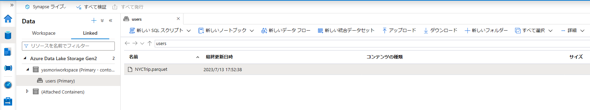
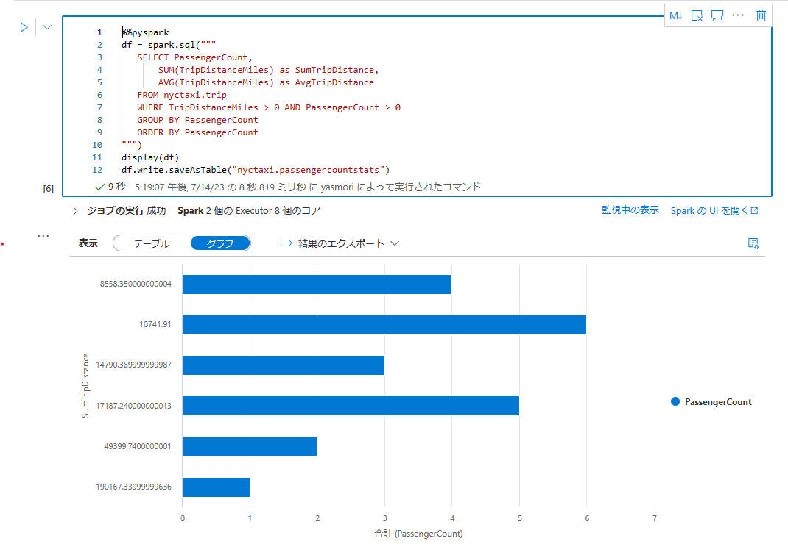
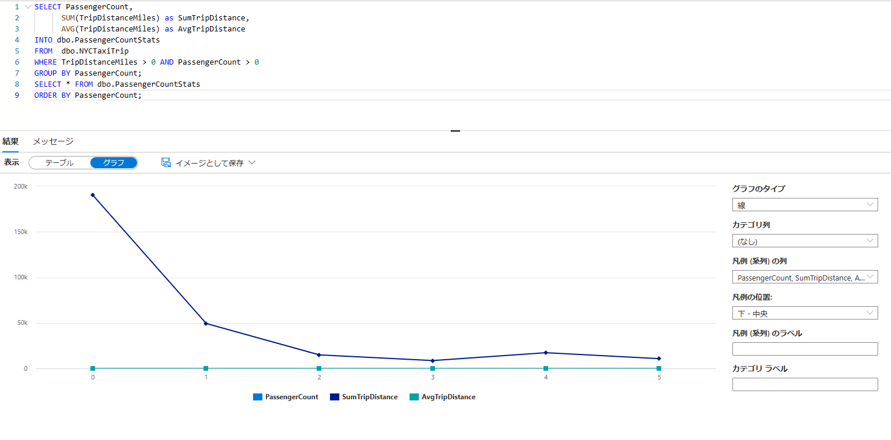

<link href="https://kevinburke.bitbucket.io/markdowncss/markdown.css" rel="stylesheet"></link>

# 演習 - Azure Synapse Analytics

本演習では、Azure Synapse Analytics の主な機能に関する操作を学びます。手順に従って進めると、Synapse ワークスペースが作成され、研修データを取り込み、サーバーレス SQL プール、Data Explorer、Apache Spark、専用 SQL プール (以前の SQL DW) 、ストレージ内のデータを分析し、Power BI でデータを可視化するまでの一連の操作を学ぶことができます。

### 目次

- [1. Synapse ワークスペースを作成する](./3-ex-AzureSynapseAnalytics.md#1-synapse-%E3%83%AF%E3%83%BC%E3%82%AF%E3%82%B9%E3%83%9A%E3%83%BC%E3%82%B9%E3%82%92%E4%BD%9C%E6%88%90%E3%81%99%E3%82%8B)
- [2. サーバーレス SQL プールを使用してデータを分析する](./3-ex-AzureSynapseAnalytics.md#2-%E3%82%B5%E3%83%BC%E3%83%90%E3%83%BC%E3%83%AC%E3%82%B9-sql-%E3%83%97%E3%83%BC%E3%83%AB%E3%82%92%E4%BD%BF%E7%94%A8%E3%81%97%E3%81%A6%E3%83%87%E3%83%BC%E3%82%BF%E3%82%92%E5%88%86%E6%9E%90%E3%81%99%E3%82%8B)
- [3. Data Explorer を使用して分析する](./3-ex-AzureSynapseAnalytics.md#3-data-explorer-%E3%82%92%E4%BD%BF%E7%94%A8%E3%81%97%E3%81%A6%E5%88%86%E6%9E%90%E3%81%99%E3%82%8B-%E3%83%97%E3%83%AC%E3%83%93%E3%83%A5%E3%83%BC)
- [4. Apache Spark を使用して分析を行う](./3-ex-AzureSynapseAnalytics.md#4-%E3%82%B5%E3%83%BC%E3%83%90%E3%83%BC%E3%83%AC%E3%82%B9-spark-%E3%83%97%E3%83%BC%E3%83%AB%E3%82%92%E4%BD%BF%E7%94%A8%E3%81%97%E3%81%A6%E5%88%86%E6%9E%90%E3%81%99%E3%82%8B)
- [5. 専用 SQL プールを使用して分析する](./3-ex-AzureSynapseAnalytics.md#5-%E5%B0%82%E7%94%A8-sql-%E3%83%97%E3%83%BC%E3%83%AB%E3%82%92%E4%BD%BF%E7%94%A8%E3%81%97%E3%81%A6%E5%88%86%E6%9E%90%E3%81%99%E3%82%8B)
- [6. ストレージ アカウント内のデータを分析する](./3-ex-AzureSynapseAnalytics.md#6-%E3%82%B9%E3%83%88%E3%83%AC%E3%83%BC%E3%82%B8-%E3%82%A2%E3%82%AB%E3%82%A6%E3%83%B3%E3%83%88%E5%86%85%E3%81%AE%E3%83%87%E3%83%BC%E3%82%BF%E3%82%92%E5%88%86%E6%9E%90%E3%81%99%E3%82%8B)
- [7. パイプラインと統合する](./3-ex-AzureSynapseAnalytics.md#7-%E3%83%91%E3%82%A4%E3%83%97%E3%83%A9%E3%82%A4%E3%83%B3%E3%81%A8%E7%B5%B1%E5%90%88%E3%81%99%E3%82%8B)
- [8. Power BI で視覚化する](./3-ex-AzureSynapseAnalytics.md#8-power-bi-%E3%81%A7%E8%A6%96%E8%A6%9A%E5%8C%96%E3%81%99%E3%82%8B)

<div>
<br><br>
</div>

## 1. Synapse ワークスペースを作成する

### 前提条件

この演習の手順を完了するには、**所有者**ロールが割り当てられているリソース グループにアクセスできる必要があります。 このリソース グループで Synapse ワークスペースを作成します。

### Azure portal で Synapse ワークスペースを作成する

#### プロセスを開始する

1. [Azure portal](https://portal.azure.com/) を開き、Enter キーを押さずに検索バーに「**Synapse**」と入力します。
2. 検索結果の **[サービス]** で、 **[Azure Synapse Analytics]** を選択します。
3. **[作成]** を選択して、ワークスペースを作成します。

#### [基本] タブ > [プロジェクトの詳細]

以下のフィールドを設定します。

1. **[サブスクリプション]** - 任意のサブスクリプションを選択します。
2. **[リソース グループ]** - 任意のリソース グループを使用します。
3. **マネージド リソース グループ** - 空白のままにします。

#### [基本] タブ > [ワークスペースの詳細]

以下のフィールドを設定します。

1. **[ワークスペース名]** - グローバルに一意の任意の名前を選択します。 この演習では、**[yourname]myworkspace** を使用します。（[yourname]の部分はご自身のお名前などを使用し、グローバルで一意になるようにます。）

2. **[リージョン]** - クライアント アプリケーションまたはサービス (Azure VM、Power BI、Azure Analysis Service など) と、データを含むストレージ (Azure Data Lake Storage、Azure Cosmos DB 分析ストレージ) が配置されているリージョンを選択します。 (ここでは **Japan East** を選択。)
   
   > **Warning**
   > 
   > クライアント アプリケーションやストレージが併置されていないワークスペースは、さまざまなパフォーマンス上の問題の根本原因になる可能性があります。 データやクライアントが複数のリージョンに配置されている場合は、データやクライアントが併置されているリージョンごとに個別のワークスペースを作成できます。

**[Data Lake Storage Gen 2 の選択]** で、次の操作を行います。

1. **[アカウント名]** で、 **[新規作成]** を選択し、新しいストレージ アカウントに **[yourname]contosolake** などの名前を付けます。この名前は一意である必要があります。（[yourname]の部分はご自身のお名前などを使用し、グローバルで一意になるようにます。）
2. **[ファイル システム名]** で、 **[新規作成]** を選択し、**users** という名前を付けます。 これにより、**users** というストレージ コンテナーが作成されます。 ワークスペースでは、このストレージ アカウントを Spark テーブルおよび Spark アプリケーション ログの "プライマリ" ストレージ アカウントとして使用します。
3. "Data Lake Storage Gen2 アカウントのストレージ BLOB データ共同作成者ロールを自分に割り当てる" ためのボックスをオンにします。

#### プロセスを完了する

**[確認および作成]**>**[作成]** の順に選択します。 ワークスペースの準備は数分で完了します。

#### Synapse Studio を開く

Azure Synapse ワークスペースが作成された後、Synapse Studio を開きます。

1. [Azure portal](https://portal.azure.com/) で 先に作成した Synapse ワークスペースを開き、Synapse ワークスペースの **[概要]** セクションで、[Synapse Studio の起動] ボックスの **[オープン]** を選択します。

　　※ブラウザに登録されているアカウントにより本手順で「読み込めませんでした」のエラーが出る場合は次の手順をお試しください。

2. `https://web.azuresynapse.net/ja/` にアクセスし、ワークスペースにサインインします。
   
   

##### プライマリ ストレージ アカウントにサンプル データを配置する

この演習では、10万行からなるニューヨーク市のタクシーデータをサンプルデータセットとして使います。まずワークスペース用に作成したプライマリストレージアカウントにこれを配置します。

1. [NYC Taxi - データセット](https://basichandsondwstorage.blob.core.windows.net/container1/NYCTrip.parquet)をお使いのコンピューターにダウンロードします。

2. ダウンロードしたファイル名が *NYCTrip.parquet* であることを確認します。

3. Synapse Studio で、**[Data]** ハブに移動します。

4. **[Linked]** を選択します。

5. **[Azure Data Lake Storage Gen2]** カテゴリの下にある、**[yourname]myworkspace ( プライマリ - [yourname]contosolake )** となっている名前の項目を展開します。

6. **[users (Primary)]** という名前のコンテナーを選択します。

7. **[アップロード]** を選択し、先ほどダウンロードした `NYCTrip.parquet` ファイルを選択します。
   
   

Parquet ファイルをアップロードしたら、次の 2 つの URI で使用できるようになります。

- `https://[yourname]contosolake.dfs.core.windows.net/users/NYCTrip.parquet`
- `abfss://users@[yourname]contosolake.dfs.core.windows.net/NYCTrip.parquet`

<div>
<font color="Red">
この後の演習では、**[yourname]contosolake** の [yourname] の部分をワークスペース作成時に設定したプライマリストレージアカウント名で置き換えて演習を進めてください。
</font>
</div>

<div>
<br>
</div>

## 2. サーバーレス SQL プールを使用してデータを分析する

### 組み込みのサーバーレス SQL プール

サーバーレス SQL プールでは、容量を予約せずに SQL を使用できます。 サーバーレス SQL プールの課金は、クエリの実行に使用されたノードの数ではなく、クエリを実行するために処理されたデータの量に基づきます。

各ワークスペースは、**組み込み**と呼ばれる、事前構成されたサーバーレス SQL プールを備えています。

### サーバーレス SQL プールを使用してニューヨーク市のタクシー データを分析する

1. Synapse Studio の左側のペインで、 **[Develop]** を選びます。

2.  **[＋]** をクリックし、新しい SQL スクリプトを作成します。

3. 以下のコードをスクリプトに貼り付けます。（[yourname]の部分はご自身でつけた名前に書き換えてください。）
   
   ```sql
   SELECT
       TOP 100 *
   FROM
       OPENROWSET(
           BULK 'https://[yourname]contosolake.dfs.core.windows.net/users/NYCTrip.parquet',
           FORMAT='PARQUET'
       ) AS [result]
   ```

5. **[実行]** を選択します。

データの探索は、自分のデータの基本的な特性が理解できる単純化されたシナリオにすぎません。 データの探索と分析の詳細については、こちらの[チュートリアル](https://learn.microsoft.com/ja-jp/azure/synapse-analytics/sql/tutorial-data-analyst)を参照してください。

### データ探索データベースを作成する

ファイルの内容は、`master` データベースを介して直接参照できます。 一部の単純なデータ探索シナリオであれば、別途データベースを作成する必要はありません。 ただしデータの探索を続けていく中で、次のようなユーティリティ オブジェクトを作成するとよい場合があります。

- ストレージ アカウントの名前付き参照を表す外部データ ソース。

- 外部データ ソースへの認証方法の指定を可能にするデータベース スコープの資格情報。

- 特定のデータ ソースまたはデータベース オブジェクトへのアクセス許可を持つデータベース ユーザー。

- クエリの中で使用できるユーティリティ ビュー、プロシージャ、関数。
1. 先の SQL スクリプトに記載されている SQL 文を消して、次の SQL 文に書き換え、実行します。 `master` データベースを使用して、カスタム データベース オブジェクト用に別のデータベースを作成します。 カスタム データベース オブジェクトを `master` データベースに作成することはできません。
   
   ```sql
   CREATE DATABASE DataExplorationDB 
                   COLLATE Latin1_General_100_BIN2_UTF8
   ```
   
   > **Note**
   > 
   > _UTF8 サフィックス付きの照合順序を使用することで、UTF-8 テキストが正しく VARCHAR 列に変換されます。 Parquet ファイルや Azure Cosmos DB コンテナーからデータを読み取るクエリでは、Latin1_General_100_BIN2_UTF8 によって最適なパフォーマンスが得られます。

2. 次のコマンドを使用して、データベース コンテキストを `master` から `DataExplorationDB` に切り替えます。 UI コントロールの **use database** を使用 して、現在のデータベースに切り替えることもできます。
   
   ```sql
   USE DataExplorationDB
   ```

3. `DataExplorationDB` から、資格情報やデータ ソースなどのユーティリティ オブジェクトを作成します。
   
   ```sql
   CREATE EXTERNAL DATA SOURCE [yourname]ContosoLake
   WITH ( LOCATION = 'https://[yourname]contosolake.dfs.core.windows.net')
   ```
   
   > **Warning**
   > 
   > 外部データ ソースは、資格情報なしで作成できます。 資格情報が存在しない場合は、外部データ ソースにアクセスするために呼び出し元の ID が使用されます。

4. 必要に応じて、新しく作成された `DataExplorationDB` データベースを使用して、外部データにアクセスする `DataExplorationDB` でユーザーのログインを作成します。
   
   ```sql
   CREATE LOGIN data_explorer WITH PASSWORD = 'Password1234!';
   ```
   
   次に、上記のログイン用に `ADMINISTER DATABASE BULK OPERATIONS` にデータベース ユーザーを作成し、`DataExplorationDB` アクセス許可を付与します。
   
   ```sql
   CREATE USER data_explorer FOR LOGIN data_explorer;
   GO
   GRANT ADMINISTER DATABASE BULK OPERATIONS TO data_explorer;
   GO
   ```

5. 相対パスとデータ ソースを使用してファイルの内容を探索します。（[yourname]の部分はご自身でつけた名前になります。）
   
   ```sql
   SELECT
       TOP 100 *
   FROM
       OPENROWSET(
               BULK '/users/NYCTrip.parquet',
               DATA_SOURCE = '[yourname]ContosoLake',
               FORMAT='PARQUET'
       ) AS [result]
   ```

6. SQL スクリプトタブ上部のメニューにある「発行」をクリックし、ワークスペースに変更を**発行**します。

データ探索データベースは、ユーティリティ オブジェクトを格納できる単純なプレースホルダーにすぎません。 Synapse SQL プールでできることは他にもたくさんあります。Azure のデータ ソース上に構築されるリレーショナル レイヤー、つまり論理データ ウェアハウスを作成することもできます。 [こちらのチュートリアルで論理データ ウェアハウスの構築](https://learn.microsoft.com/ja-jp/azure/synapse-analytics/sql/tutorial-data-analyst)について詳しく説明しています。

<div>
<br>
</div>

### 3. Data Explorer を使用して分析する (プレビュー)

### Data Explorer プールを作成する

1. Synapse Studio の左側のペインで、**[Manage]** > **[Data Explorer プール]** を選びます。

2. **[新規]** を選び、 **[基本]** タブで、以下の詳細を入力します。
   
   | **設定**                   | **推奨値**             | **説明**                                    |
   | ------------------------ | ------------------- | ----------------------------------------- |
   | Azure Data Explorer プール名 | contosoadx | これは、Azure Data Explorer プールに付けられる名前です。    |
   | ワークロード                   | Compute optimized   | このワークロードにより、CPU から SSD へのストレージの比率が高くなります。 |
   | ノード サイズ                  | Small (4 コア)        | この演習のコストを削減するために、最小サイズに設定します。             |
   
   > **Note**
   > 
   > Azure Data Explorer プールで使用できる名前には、特定の制限があることに注意してください。 この名前には、4 文字から 15 文字の間で小文字と数字のみを含める必要があります。また、先頭は文字で始める必要があります。

3. **[確認および作成]** -> **[作成]** の順に選択します。 Azure Data Explorer プールのプロビジョニング プロセスが開始されます。

### Data Explorer データベースを作成する

1. Synapse Studio の左側のペインで、 **[Data]** を選びます。

2. **+** (新しいリソースの追加) > **[Data Explorer データベース]** を選び、次の情報を貼り付けます。
   
   | **設定**     | **推奨値**             | **説明**                                                               |
   | ---------- | ------------------- | -------------------------------------------------------------------- |
   | プール名       | contosoadx | 使用する Data Explorer プールの名前                                            |
   | 名前         | TestDatabase        | データベース名はクラスター内で一意である必要があります。                                         |
   | 既定の保持期間    | 365                 | クエリにデータを使用できることが保証される期間 (日数) です。 期間は、データが取り込まれた時点から測定されます。           |
   | 既定のキャッシュ期間 | 31                  | 頻繁にクエリされるデータが、長期ストレージではなく SSD ストレージまたは RAM で利用できるように保持される期間 (日数) です。 |

3. **[作成]** を選択してデータベースを作成します。 通常、作成にかかる時間は 1 分未満です。

## サンプル データを取り込み、単純なクエリで分析する

1. Synapse Studio の左側のペインで、 **[Develop]** を選びます。

2. **[+]** (新しいリソースの追加) >**[KQL スクリプト]** を選びます。 右側のウィンドウで、スクリプト名を指定できます。

3. **[接続先]** メニューで、[*contosoadx*] を選択します。

4. **[データベースの使用]** メニューで、 *[TestDatabase]* を選びます。

5. 次のコマンドを貼り付け、**[実行]** を選択して、StormEvents テーブルを作成します。
   
   ```kusto
   .create table StormEvents (StartTime: datetime, EndTime: datetime, EpisodeId: int, EventId: int, State: string, EventType: string, InjuriesDirect: int, InjuriesIndirect: int, DeathsDirect: int, DeathsIndirect: int, DamageProperty: int, DamageCrops: int, Source: string, BeginLocation: string, EndLocation: string, BeginLat: real, BeginLon: real, EndLat: real, EndLon: real, EpisodeNarrative: string, EventNarrative: string, StormSummary: dynamic)
   ```
   
   > **Note**
   > 
   > テーブルが正常に作成されたことを確認します。 左側のペインで、**[Data]** を選び、*contosoadx* のその他のメニューを選び、**[最新の情報に更新]** を選択します。 *[contosoadx]* で **[テーブル]** を展開し、*StormEvents* テーブルが一覧に表示されていることを確認します。

6. 次のコマンドを貼り付け、**[実行]** を選択して、StormEvents テーブルにデータを取り込みます。
   
   ```kusto
   .ingest into table StormEvents 'https://kustosamples.blob.core.windows.net/samplefiles/StormEvents.csv' with (ignoreFirstRecord=true)
   ```

7. 取り込みが完了したら、次のクエリに貼り付けて､ウィンドウでクエリを選択し､**[実行]** を選択します。
   
   ```kusto
   StormEvents
   | sort by StartTime desc
   | take 10
   ```
   
   取り込まれたサンプル データから次のクエリ結果が返されます。
   
   

8. ワークスペースに変更を**発行**します。

<div>
<br>
</div>

## 4. サーバーレス Spark プールを使用して分析する

### サーバーレス Apache Spark プールを作成する

1. Synapse Studio の左側のペインで、 **[Manage]**>**[Apache Spark pools]** を選択します。

2. **[新規]** を選択します。

3. **[Apache Spark プール名]** に「**Spark1**」と入力します。

4. **[ノードサイズファミリ]** に「メモリ最適化済み」を選択します。

5. **[ノード サイズ]** に「**Small**」を選択します。

6. **[自動スケーリング]** を「無効」に設定します。

7. **[ノード数]** を 3 に設定します。

8. **[エグゼキューターを動的に割り当てる]** を「無効」に設定します。

9. **[確認および作成]**>**[作成]** の順に選択します。 Apache Spark プールの準備は数秒で完了します。

### サーバーレス Apache Spark プールについて

サーバーレス Spark プールは、ユーザーが Spark の操作方法を示すための手段です。 プールの使用を開始すると、必要に応じて Spark セッションが作成されます。 プールでは、そのセッションで使用される Spark リソースの数と、セッションが自動的に一時停止するまでの継続時間を制御します。 課金は、プール自体ではなく、そのセッション中に使用された Spark リソースに対して発生します。 このように、Spark プールを使用すると、クラスターを管理せずに Apache Spark を使用できます。 これは、サーバーレス SQL プールの動作に似ています。

### Spark プールで NYC タクシーのデータを分析する

1. Synapse Studio で、 **[Develop]** ハブに移動します。

2. 新しい ノートブック を作成します。

3. 新しいコード セルを作成し、以下のコードをそのセルに貼り付けます。（[yourname]の部分はご自身でつけた名前に書き換えてください。）
   
   ```py
   %%pyspark
   df = spark.read.load('abfss://users@[yourname]contosolake.dfs.core.windows.net/NYCTrip.parquet', format='parquet')
   display(df.limit(10))
   ```

4. [abfss URI スキーム](https://learn.microsoft.com/ja-jp/azure/storage/blobs/data-lake-storage-introduction-abfs-uri)に従ってストレージ アカウント内のサンプル ファイルを参照するように、読み込み URI を変更します。

5. ノートブックの **[アタッチ先]** メニューで、前に作成した **Spark1** サーバーレス Spark プールを選択します。

6. セルで **[実行]** を選択します。 このセルを実行するために必要であれば、Synapse によって新しい Spark セッションが開始されます。 新しい Spark セッションが必要な場合、最初は作成に約 2 分かかります。

7. データフレームのスキーマを表示するだけの場合は、次のコードを使用してセルを実行します。
   
   ```py
   %%pyspark
   df.printSchema()
   ```

### NYC タクシーのデータを Spark nyctaxi データベースに読み込む

データは、**df** という名前のデータフレームを使って取得できます。 それを **nyctaxi** という名前の Spark データベースに読み込みます。

1. ノートブックに新しいコード セルを追加し、次のコードを入力します。
   
   ```py
   %%pyspark
   spark.sql("CREATE DATABASE IF NOT EXISTS nyctaxi")
   df.write.mode("overwrite").saveAsTable("nyctaxi.trip")
   ```

### Spark とノートブックを使用して NYC タクシーのデータを分析する

1. 新しいコード セルを作成し、次のコードを入力します。
   
   ```py
   %%pyspark
   df = spark.sql("SELECT * FROM nyctaxi.trip") 
   display(df)
   ```

2. このセルを実行して、**nyctaxi** Spark データベースに読み込んだ NYC Taxi データを表示します。

3. 新しいコード セルを作成し、次のコードを入力します。 このデータを分析し、**nyctaxi.passengercountstats** というテーブルに結果を保存します。
   
   ```py
   %%pyspark
   df = spark.sql("""
      SELECT PassengerCount,
          SUM(TripDistanceMiles) as SumTripDistance,
          AVG(TripDistanceMiles) as AvgTripDistance
      FROM nyctaxi.trip
      WHERE TripDistanceMiles > 0 AND passengerCount > 0
      GROUP BY PassengerCount
      ORDER BY PassengerCount
   """) 
   display(df)
   df.write.saveAsTable("nyctaxi.passengercountstats")
   ```

4. セルの結果で **[グラフ]** を選択し、視覚化されたデータを確認します。
   
   

5. ワークスペースに変更を**発行**します。

<div>
<br>
</div>

## 5. 専用 SQL プールを使用して分析する

### 専用 SQL プールを作成する

1. Synapse Studio の左側のウィンドウで、 **[Manage]**>**[SQL pools]** を選択します。

2. **[新規]** を選択します。

3. **[専用 SQL プール名]** で **[SQLPOOL1]** を選択します

4. **[パフォーマンス レベル]** で **[DW100C]** を選択します。

5. **[確認および作成]**>**[作成]** の順に選択します。 専用 SQL プールの準備は数分で完了します。

作成した専用 SQL プールは、**SQLPOOL1** という SQL データベースに関連付けられます。

1. **[Data]**>**[Workspace]** の順に移動します。

2. **SQLPOOL1** という名前のデータベースが表示されます。 表示されない場合は、 **[最新の情報に更新]** をクリックします。

専用 SQL プールがアクティブである限り、課金対象のリソースが消費されます。 コストを削減するために、後でプールを一時停止できます。

> **Warning**
> 
> ワークスペースに新しい専用 SQL プール (以前の SQL DW) を作成すると、専用の SQL プールのプロビジョニング ページが開きます。 プロビジョニングは、論理 SQL サーバー上で行われます。

### NYC タクシー データを SQLPOOL1 に読み込む

1. Synapse Studio で **[Develop]** ハブに移動し、新しいリソースを追加するための **+** ボタンをクリックして、新しい SQL スクリプトを作成します。

2. スクリプトの上にある **[次に接続]** ドロップダウン リストで、"SQLPOOL1" プール を選択します。

3. 次のコードを入力します。（[yourname]の部分はご自身でつけた名前に書き換えてください。）
   
   ```sql
   IF NOT EXISTS (SELECT * FROM sys.objects O JOIN sys.schemas S ON O.schema_id = S.schema_id WHERE O.NAME = 'NYCTaxiTripSmall' AND O.TYPE = 'U' AND S.NAME = 'dbo')
   CREATE TABLE dbo.NYCTaxiTrip
       (
        [DateID] int,
        [MedallionID] int,
        [HackneyLicenseID] int,
        [PickupTimeID] int,
        [DropoffTimeID] int,
        [PickupGeographyID] int,
        [DropoffGeographyID] int,
        [PickupLatitude] float,
        [PickupLongitude] float,
        [PickupLatLong] nvarchar(4000),
        [DropoffLatitude] float,
        [DropoffLongitude] float,
        [DropoffLatLong] nvarchar(4000),
        [PassengerCount] int,
        [TripDurationSeconds] int,
        [TripDistanceMiles] float,
        [PaymentType] nvarchar(4000),
        [FareAmount] numeric(19,4),
        [SurchargeAmount] numeric(19,4),
        [TaxAmount] numeric(19,4),
        [TipAmount] numeric(19,4),
        [TollsAmount] numeric(19,4),
        [TotalAmount] numeric(19,4)
       )
   WITH
       (
       DISTRIBUTION = ROUND_ROBIN,
        CLUSTERED COLUMNSTORE INDEX
        -- HEAP
       )
   GO
   
   COPY INTO dbo.NYCTaxiTrip
   (DateID 1, MedallionID 2, HackneyLicenseID 3, PickupTimeID 4, DropoffTimeID 5,
   PickupGeographyID 6, DropoffGeographyID 7, PickupLatitude 8, PickupLongitude 9, 
   PickupLatLong 10, DropoffLatitude 11, DropoffLongitude 12, DropoffLatLong 13, 
   PassengerCount 14, TripDurationSeconds 15, TripDistanceMiles 16, PaymentType 17, 
   FareAmount 18, SurchargeAmount 19, TaxAmount 20, TipAmount 21, TollsAmount 22, 
   TotalAmount 23)
   FROM 'https://[yourname]contosolake.dfs.core.windows.net/users/NYCTrip.parquet'
   WITH
   (
       FILE_TYPE = 'PARQUET'
       ,MAXERRORS = 0
       ,IDENTITY_INSERT = 'OFF'
   )
   ```

4. **[実行]** ボタンをクリックして、スクリプトを実行します。

5. このスクリプトは 60 秒以内に終了します。 10 万行の NYC タクシー データを `dbo.NYCTaxiTrip` というテーブルに読み込みます。

### 専用 SQL プール内の NYC タクシーのデータを探索する

1. Synapse Studio で、 **[Data]** ハブに移動します。

2. **[SQLPOOL1]**>**[テーブル]** の順に移動します。

3. **dbo.NYCTaxiTrip** テーブルを右クリックし、 **[新しい SQL スクリプト]** > **[上位 100 行を選択]** を選択します。

4. 新しい SQL スクリプトが作成されて実行されるまで待ちます。

5. SQL スクリプトの上部の **[次に接続]** が自動的に **SQLPOOL1** という SQL プールに設定されることに注意してください。

6. SQL スクリプトのテキストをこのコードで置き換えて実行します。
   
   ```sql
   SELECT PassengerCount,
         SUM(TripDistanceMiles) as SumTripDistance,
         AVG(TripDistanceMiles) as AvgTripDistance
   INTO dbo.PassengerCountStats
   FROM  dbo.NYCTaxiTrip
   WHERE TripDistanceMiles > 0 AND PassengerCount > 0
   GROUP BY PassengerCount;
   SELECT * FROM dbo.PassengerCountStats
   ORDER BY PassengerCount;
   ```
   
   このクエリは、合計乗車距離と平均乗車距離が乗客数とどのように関係しているかを示します。

7. SQL スクリプトの結果ウィンドウで、 **[ビュー]** を **[グラフ]** に変更して、結果を折れ線グラフとして視覚的に表示します。
   
   

8. ワークスペースに変更を**発行**します。

### 6. ストレージ アカウント内のデータを分析する

### 概要

ここまでは、データがワークスペース内のデータベースに存在するシナリオについて説明してきました。 次に、ストレージ アカウント内のファイルを操作する方法について説明します。 このシナリオでは、ワークスペースの作成時に指定したワークスペースとコンテナーのプライマリ ストレージ アカウントを使用します。

- ストレージ アカウントの名前: **[yourname]contosolake**

- ストレージ アカウント内のコンテナーの名前: **users**

### ストレージ アカウントに CSV および Parquet ファイルを作成する

ノートブックの新しいコード セルで次のコードを実行します。 ストレージ アカウントに CSV ファイルと parquet ファイルが作成されます。

```py
%%pyspark
df = spark.sql("SELECT * FROM nyctaxi.passengercountstats")
df = df.repartition(1) # This ensures we'll get a single file during write()
df.write.mode("overwrite").csv("/NYCTaxi/PassengerCountStats_csvformat")
df.write.mode("overwrite").parquet("/NYCTaxi/PassengerCountStats_parquetformat")
```

### ストレージ アカウント内のデータを分析する

対象のワークスペースの既定の ADLS Gen2 アカウントのデータを分析できます。また、**[Manage]**>**[Linked services]**>**[新規]** を使用して、ADLS Gen2 または BLOB ストレージ アカウントを対象のワークスペースにリンクすることもできます (以下の手順ではプライマリ ADLS Gen2 アカウントを参照します)。

1. Synapse Studio の **[Data]** ハブに移動し、 **[Linked]** を選択します。

2. **[Azure Data Lake Storage Gen2]**>**[[yourname]myworkspace (Primary - [yourname]contosolake)]** に移動します。

3. **[users (Primary)]** を選択します。 **NYCTaxi** フォルダーが表示されます。 その中に、**PassengerCountStats_csvformat** および **PassengerCountStats_parquetformat** という 2 つのフォルダーが表示されます。

4. **PassengerCountStats_parquetformat** フォルダーを開きます。 内部に、`part-00000-2638e00c-0790-496b-a523-578da9a15019-c000.snappy.parquet` のような名前の parquet ファイルがあります。

5. **parquet** を右クリックして、 **[新しいノートブック]** を選択し、 **[DataFrame に読み込む]** を選択します。 次のようなセルを含む新しいノートブックが作成されます。
   
   ```py
   %%pyspark
   abspath = 'abfss://users@[yourname]contosolake.dfs.core.windows.net/NYCTaxi/PassengerCountStats_parquetformat/part-00000-1f251a58-d8ac-4972-9215-8d528d490690-c000.snappy.parquet'
   df = spark.read.load(abspath, format='parquet')
   display(df.limit(10))
   ```

6. **Spark1** という名前の Spark プールにアタッチします。 セルを実行します。 コア不足に関連するエラーが発生した場合、この Spark プールは別のセッションで使用されている可能性があります。 既存のすべてのセッションを取り消し、やり直しててください。

7. **users** フォルダーを選択します。 **parquet** ファイルをもう一度右クリックし、 **[新しい SQL スクリプト]**>**[上位 100 行を選択]** の順に選択します。 次のような SQL スクリプトが作成されます。
   
   ```sql
   SELECT 
       TOP 100 *
   FROM OPENROWSET(
       BULK 'https://[yourname]contosolake.dfs.core.windows.net/users/NYCTaxi/PassengerCountStats_parquetformat/part-00000-1f251a58-d8ac-4972-9215-8d528d490690-c000.snappy.parquet',
       FORMAT='PARQUET'
   ) AS [result]
   ```
   
   スクリプト ウィンドウで、 **[次に接続]** フィールドが**組み込み**のサーバーレス SQL プールに設定されていることを確認します。

8. スクリプトを実行します。

9. ワークスペースに変更を**発行**します。

<div>
<br>
</div>

---

## 7. パイプラインと統合する

この演習では、Synapse Studio を使用してパイプラインとアクティビティを統合する方法について説明します。

### パイプラインを作成してノートブック アクティビティを追加する

1. Synapse Studio で、 **[Integrate]** ハブに移動します。

2. **+**>**[パイプライン]** を選択して新しいパイプラインを作成します。 新しいパイプライン オブジェクトをクリックして、パイプライン デザイナーを開きます。

3. **[アクティビティ]** で **[Synapse]** フォルダーを展開し、**ノートブック** オブジェクトをデザイナーにドラッグします。

4. ノートブック アクティビティのプロパティの **[設定]** タブを選択します。 ドロップダウン リストを使用して、現在の Synapse ワークスペースからノートブックを選択します。

### パイプラインを 1 時間ごとに実行するようにスケジュールを設定する

1. パイプラインで、 **[トリガーの追加]**>**[新規/編集]** を選択します。

2. **[トリガーの選択]** で **[+新規]** を選択し、 **[繰り返し]** を "1 時間" に設定します。

3. **[OK]** を選択します。

4. **[すべて発行]** を選択します。

### 強制的にパイプラインを即座に実行する

パイプラインが発行されたら、1 時間経過するのを待たずにすぐに実行することができます。

1. パイプラインを開きます。

2. **[トリガーの追加]**>**[今すぐトリガー]** の順にクリックします。

3. **[OK]** を選択します。

### パイプラインの実行を監視する

1. **[Monitor]** ハブに移動します。

2. パイプラインの実行の進行状況を監視するには、 **[Pipleline runs]** を選択します。

3. このビューでは、表形式の**一覧**表示とグラフィカルな**ガント** チャートを切り替えることができます。

4. パイプライン名をクリックして、そのパイプラインのアクティビティの状態を確認します。

<div>
<br>
</div>

## 8. Power BI で視覚化する

この演習では、Power BI ワークスペースの作成方法、Azure Synapse ワークスペースのリンク方法、Azure Synapse ワークスペースのデータを利用する Power BI データ セットの作成方法について説明します。

### <mark>前提条件</mark>

この演習を完了するには、[Power BI Desktop をインストール](https://aka.ms/pbidesktopstore)してください。

### 概要

NYC タクシーのデータから、2 つのテーブルに集約されたデータセットを作成しました。

- **nyctaxi.passengercountstats**

- **SQLDB1.dbo.PassengerCountStats**

Power BI ワークスペースを Azure Synapse ワークスペースにリンクすることができます。 この機能により、Power BI ワークスペースに簡単にデータを取り込むことができます。 Power BI レポートは、Azure Synapse ワークスペースで直接編集できます。

### Power BI ワークスペースを作成する

1. [powerbi.microsoft.com](https://powerbi.microsoft.com/) にサインインします。

2. **[ワークスペース]** をクリックし、 **[ワークスペースの作成]** を選択します。 **NYCTaxiWorkspace1** などの名前の新しい Power BI ワークスペースを作成します。この名前は一意である必要があります。

### Azure Synapse ワークスペースを新しい Power BI ワークスペースにリンクする

1. Synapse Studio で、 **[Manage]**>**[Linked services]** に移動します。

2. **[+新規]**>**[Power BI アカウントに接続する]** の順に選択します。

3. **[名前]** を **NYCTaxiWorkspace1** に設定します。

4. **[ワークスペース名]** を、上記で作成した Power BI ワークスペース (**NYCTaxiWorkspace1** など) に設定します。

5. **［作成］** を選択します。

### Azure Synapse ワークスペース内のデータを使用する Power BI データセットを作成する

1. Synapse Studio で、 **[Develop]**>**[Power BI]** に移動します。

2. **[NYCTaxiWorkspace1]**>**[Power BI データセット]** に移動し、 **[+ 新しい Power BI データセット]** を選択します。 **[開始]** をクリックします。

3. **[SQLPOOL1]** データ ソースを選択し、 **[続行]** をクリックします。

4. **[ダウンロード]** をクリックして、**NYCTaxiWorkspace1SQLPOOL1.pbids** ファイルに対応する .pbids ファイルをダウンロードします。 **[続行]** をクリックします。

5. ダウンロードした **.pbids** ファイルを開きます。 Power BI Desktop が開き、Azure Synapse ワークスペース内の **SQLDB1** に自動的に接続されます。

6. **[SQL Server データベース]** というダイアログ ボックスが表示された場合は、次の手順を実行します。
   
   1. **[Microsoft アカウント]** を選択します。
   2. **[サインイン]** を選択してアカウントにサインインします。
   3. **[接続]** を選択します。

7. **[ナビゲーター]** ダイアログ ボックスが開いたら、**PassengerCountStats** テーブルをチェックし、 **[読み込み]** を選択します。

8. **[接続の設定]** ダイアログ ボックスが表示されたら、 **[DirectQuery]**>**[OK]** をクリックします。

9. 左側の **[レポート ビュー]** ボタンを選択します。

10. **[視覚化]** で折れ線グラフ アイコンをクリックして、レポートに**折れ線グラフ**を追加します。
    
    1. **[データ]** で、 **[PassengerCount]** 列を **[視覚化]**>**[X軸]** にドラッグします。
    2. **SumTripDistance** 列と **AvgTripDistance** 列を **[視覚化]**>**[Y軸]** にドラッグします。

11. **[ホーム]** タブで **[発行]** を選択します。

12. **[保存]** を選択して変更を保存します。

13. **PassengerAnalysis.pbix** というファイル名を選択し、 **[保存]** を選択します。

14. **[Power BI へ発行]** ウィンドウの **[宛先を選択してください]** で、 **[NYCTaxiWorkspace1]** を選択し、 **[選択]** をクリックします。

15. 発行が完了するまで待ちます。

### データセットの認証を構成する

1. [powerbi.microsoft.com](https://powerbi.microsoft.com/) を開き、**サインイン**します。

2. 左側の **[ワークスペース]** で、**NYCTaxiWorkspace1** ワークスペースを選択します。

3. ワークスペース内で、**Passenger Analysis** というデータセットと **Passenger Analysis** というレポートを探します。

4. **PassengerAnalysis** データセットにマウス ポインターを合わせ、省略記号 (...) ボタンを選択して、 **[設定]** を選択します。

5. **[データ ソースの資格情報]** で、 **[資格情報を編集]** をクリックし、 **[認証方法]** を **[OAuth2]** に設定して、 **[サインイン]** を選択します。

### Synapse Studio でレポートを編集する

1. Synapse Studio に戻ります。

2. **[Develop]** ハブに移動します。

3. **[Power BI]** レイヤーの右側にある省略記号 (...) ボタンをクリックし、 **[最新の情報に更新]** をクリックして、 **[Power BI レポート]** ノードを更新します。

4. **[Power BI]** に次のものが表示されます。
   
   - **[NYCTaxiWorkspace1]**>**[Power BI データセット]** に、**PassengerAnalysis** という新しいデータセットが表示されます。
   - **[NYCTaxiWorkspace1]**>**[Power BI レポート]** に、**PassengerAnalysis** という新しいレポートが表示されます。

5. **PassengerAnalysis** レポートを選択します。 レポートが開き、Synapse Studio 内で直接レポートを編集することができます。
