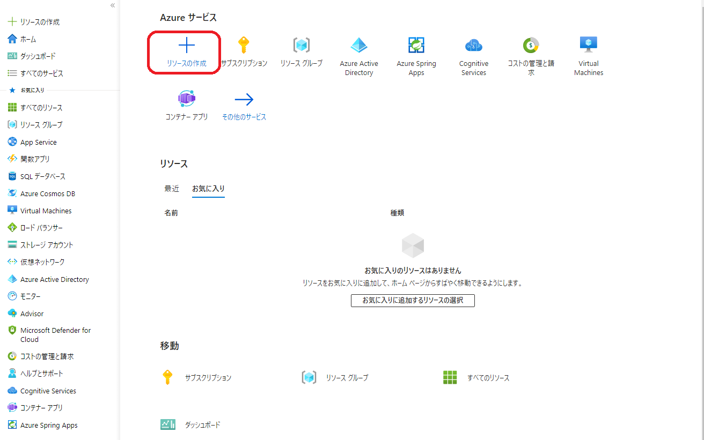
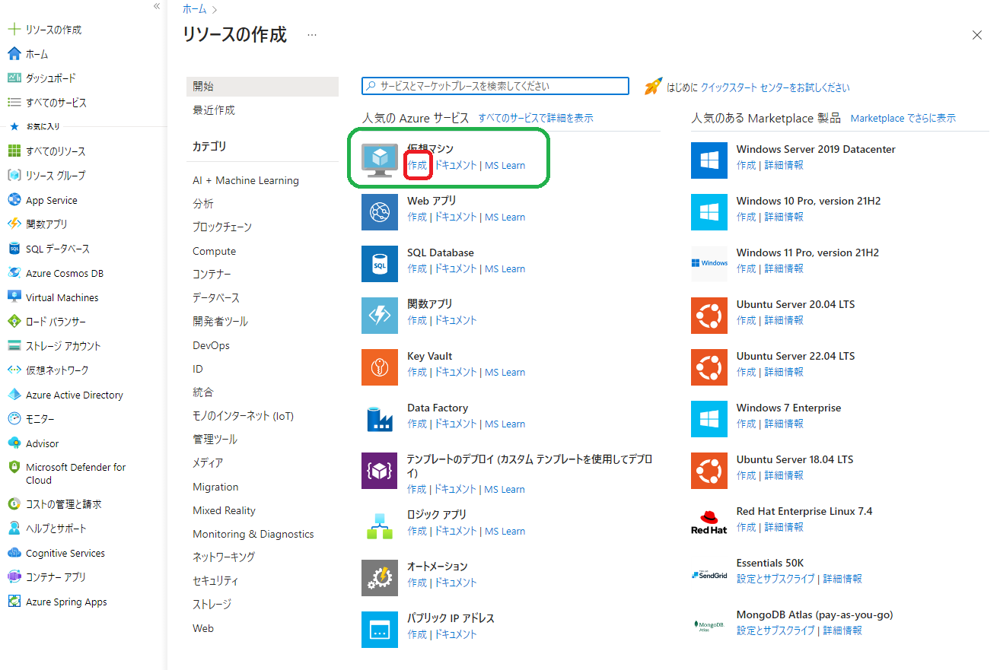
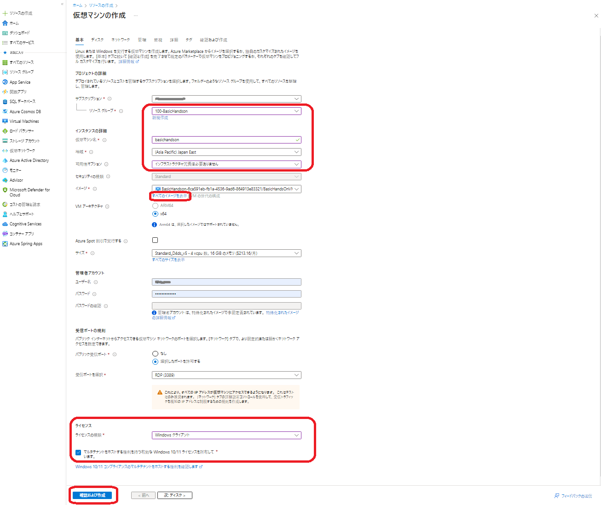
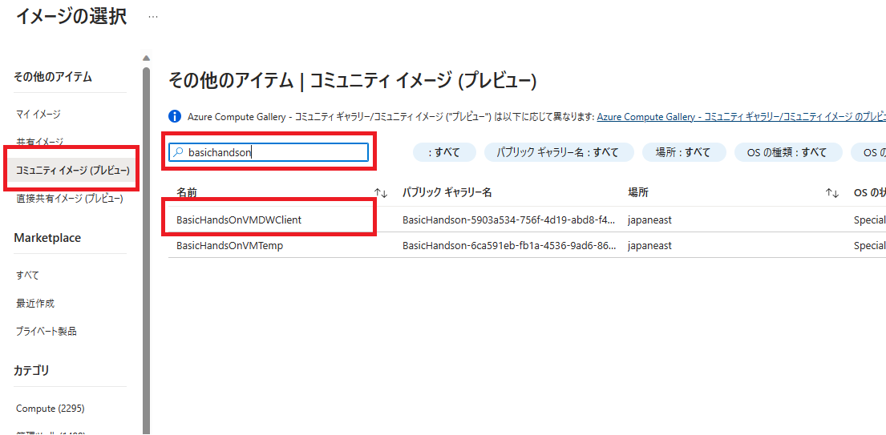
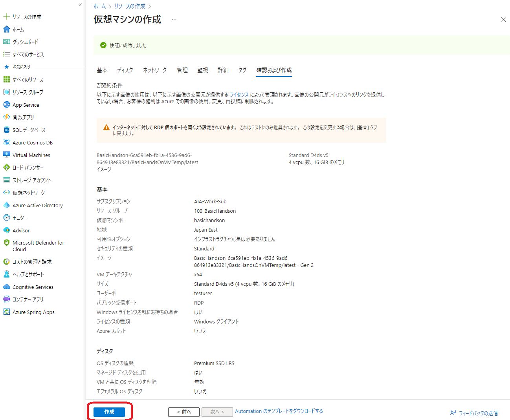

# Azure Basic Hands-on DW トレーニング

## Introduction

このトレーニングでは、Azure の PaaS におけるデータ分析基盤を構築する方法を学ぶことができます。Azure を使うのが初めての方で分析基盤の構築に携わる方が、Azure における分析基盤を構築する際の中心となる Synapse Analytics の基本機能や操作を知りたい方におすすめです。

まず分析基盤構築において最も多くの時間を割くことになるデータ取り込み・変換を Data Factory を使い行います。その後 Synapse Analytics の各機能を用いてデータ分析を行いながら、Power BI で可視化します。

このトレーニングでは、以下のサービスを利用します。

- Azure Data Lake Storage Gen2
- Azure Data Factory
- Azure SQL Database
- Azure Synapse Analytics
- Power BI

### 前提条件

- 初心者レベルでの Azure portal を使用するリソースの作成および管理経験

 

## Goal

このモジュールでは、次のことを行います。

### 1. Azure データ分析基盤概要について

- Azure データ分析基盤の全体像を説明を聞いて理解する

### 2. Azure Data Factory を触ってみる

- データインジェストで主に使用される Azure Data Factory について理解する
- Azure Data Factory と V-NET 内にある リソース との連携方法を理解する

### 3. Azure Synapse Analytics を触ってみる

- Azure のデータ分析統合基盤である Azure Synapse Analytics について理解する
- Azure Synapse Analytics の各機能の基本操作を理解する

### 4. Azure Synapse Analytics マネージド仮想ネットワークを触ってみる

- Azure Synapse Analyticsのマネージド仮想ネットワークについて理解する
- Azyre Synapse Analytics と Azureの各リソース とのプライベート接続について理解する

 

---

## Contents

### 0. 開発環境 VM を作成

  

    詳細の手順はこちらをクリックしてご参照ください。
  

  

1. 下記画像と同じになるように`リソースの作成`を選択します。
   
   

2. 下記画像と同じになるように`仮想マシン - 作成`をクリックします。
   
   

3. 下記画像と同じになるように赤枠の項目を全て設定し、`全てのイメージを表示`を選択します。次のステップのようにイメージを選択した後に`確認および作成`をクリックします。
   
   

4. 下記画像と同じになるようにハンズオン用のイメージを選択します。
   
   

5. 下記画像と同じになるように`作成`をクリックします。
   
   

以上でハンズオン用開発環境 VM の作成作業が完了です。

 

### 1. Azure データ分析基盤概要について

[Azure データ分析基盤の全体像](./1.AzureDataPlatform.pdf)を説明を聞いて理解する。

 

### 2.Azure Data Factory を触ってみる

データインジェストで主に使用される Azure Data Factory について理解し、そのうえで Azure Data Factoryを使用してデータのコピー・変換を実施します。

#### 2-1. データを Azure Data Factory または Azure Synapse Pipeline と統合する

Azure Data Factory と、クラウドで大規模なデータ インジェスト ソリューションを作成ためのコア コンポーネントについて説明します。

- Challenge-01 [はじめに](https://learn.microsoft.com/ja-jp/training/modules/data-integration-azure-data-factory/1-introduction)

- Challenge-02 [Azure Data Factory を理解する](https://learn.microsoft.com/ja-jp/training/modules/data-integration-azure-data-factory/2-understand)

- Challenge-03 [データ統合パターンを説明する](https://learn.microsoft.com/ja-jp/training/modules/data-integration-azure-data-factory/3-describe-data-integration-patterns)

- Challenge-04 [データ ファクトリ プロセスについて説明する](https://learn.microsoft.com/ja-jp/training/modules/data-integration-azure-data-factory/4-explain-process)

- Challenge-05 [Azure Data Factory コンポーネントを理解する](https://learn.microsoft.com/ja-jp/training/modules/data-integration-azure-data-factory/5-understand-components)

- Challenge-06 [Azure Data Factory のセキュリティ - Training | Microsoft Learn](https://learn.microsoft.com/ja-jp/training/modules/data-integration-azure-data-factory/6-security)

- Challenge-07 [Azure Data Factory を設定する - Training | Microsoft Learn](https://learn.microsoft.com/ja-jp/training/modules/data-integration-azure-data-factory/7-set-up)

#### 2-2. Azure Data Factory または Azure Synapse パイプラインを使用したペタバイト規模のインジェスト

Azure Data Factory を使用してさまざまなデータ ストア間でデータを取り込むために使用できる各種の方法について説明します。

- Challenge-01 [はじめに](https://learn.microsoft.com/ja-jp/training/modules/petabyte-scale-ingestion-azure-data-factory/1-introduction)

- Challenge-02 [データ ファクトリのインジェスト メソッドの一覧](https://learn.microsoft.com/ja-jp/training/modules/petabyte-scale-ingestion-azure-data-factory/2-list-ingestion-methods)

- Challenge-03 [データ ファクトリのコネクタの説明](https://learn.microsoft.com/ja-jp/training/modules/petabyte-scale-ingestion-azure-data-factory/3-describe-connectors)

- Challenge-04 [演習 - データのコピー ツールを使用してデータをコピーする - Azure Data Factory | Microsoft Learn](https://learn.microsoft.com/ja-jp/azure/data-factory/quickstart-hello-world-copy-data-tool)
  ※注意事項： [フォルダーパス]等でコンテナ名が「adftutorial」とありますが「datafactory」の誤りです。

- Challenge-05 [演習 - セルフホステッド統合ランタイムを管理する - Training | Microsoft Learn](https://learn.microsoft.com/ja-jp/training/modules/petabyte-scale-ingestion-azure-data-factory/5-manage-self-hosted-integration-runtime)

- Challnege-06 [演習 - Azure 統合ランタイムをセットアップする - Training | Microsoft Learn](https://learn.microsoft.com/ja-jp/training/modules/petabyte-scale-ingestion-azure-data-factory/6-set-up-azure-integration-runtime)

- Challenge-07 [データ インジェストのセキュリティに関する考慮事項を理解する](https://learn.microsoft.com/ja-jp/training/modules/petabyte-scale-ingestion-azure-data-factory/7-understand-data-ingestion-security-considerations)

#### 2-3. コードを書かずに Azure Data Factory または Azure Synapse パイプラインを使用して大規模な変換を実行する

Azure Data Factory 内でコードを使用せずに一般的なデータ変換およびクレンジング アクティビティを実行する方法について説明します。

- Challenge-01 [はじめに](https://learn.microsoft.com/ja-jp/training/modules/code-free-transformation-scale/1-introduction)

- Challenge-02 [Azure Data Factory での変換方法について説明する](https://learn.microsoft.com/ja-jp/training/modules/code-free-transformation-scale/2-explain-transformation-methods)

- Challenge-03 [Azure Data Factory での変換の種類について説明する](https://learn.microsoft.com/ja-jp/training/modules/code-free-transformation-scale/3-describe-transformation-types)

- Challenge-04 [演習 - Azure Data Factory のマッピング データ フローを作成する](./2-3-4-ex-TransformDataUsingMappingDataFlows.md)

- Challenge-05 [マッピング データ フローをデバッグする](https://learn.microsoft.com/ja-jp/training/modules/code-free-transformation-scale/5-debug-mapping-data-flow)

参考

- Challenge-06 [演習 - Azure Data Factory のラングリング データを使う - Training | Microsoft Learn](https://learn.microsoft.com/ja-jp/training/modules/code-free-transformation-scale/6-use-wrangling-data)

- Challenge-07 [演習 - Azure Data Factory 内でコンピューティング変換を使う - Training | Microsoft Learn](https://learn.microsoft.com/ja-jp/training/modules/code-free-transformation-scale/7-use-compute-transformations)

- Challenge-08 [演習 - Azure Data Factory 内で SQL Server Integration Services パッケージを統合する - Training | Microsoft Learn](https://learn.microsoft.com/ja-jp/training/modules/code-free-transformation-scale/8-integrate-sql-server-integration-services-packages)
  
  

  

 

### 3. Azure Synapse Analytics を触ってみる

Azure Synapse Analytics の主な機能に関するステップバイステップガイドになります。

 手順に従って進めると、Synapse ワークスペースが作成されます。 専用 SQL プール (以前の SQL DW) 用のワークスペースを有効にする手順も含まれています。 ワークスペースが作成されたら、専用 SQL プール、サーバーレス SQL プール、またはサーバーレス Apache Spark プールを使用して、データの分析を開始できます。またPower BI と連携した可視化も行うことが可能です。

- Challenge [演習 - Azure Synapse Analytics](./3-ex-AzureSynapseAnalytics.md)
  
  

   
  

### <参考> Azure Synapse Analytics のマネージド仮想ネットワーク

Azure Synapse Analytics のマネージド仮想ネットワークについて説明します。

- Challenge-01 [マネージド仮想ネットワーク - Azure Synapse Analytics | Microsoft Learn](https://learn.microsoft.com/ja-jp/azure/synapse-analytics/security/synapse-workspace-managed-vnet)

- Challenge-02[制限されたネットワークから Azure Synapse Analytics Studio のワークスペース リソースに接続する - Azure Synapse Analytics | Microsoft Learn](https://learn.microsoft.com/ja-jp/azure/synapse-analytics/security/how-to-connect-to-workspace-from-restricted-network)

- Challenge-03 [マネージド プライベート エンドポイント - Azure Synapse Analytics | Microsoft Learn](https://learn.microsoft.com/ja-jp/azure/synapse-analytics/security/synapse-workspace-managed-private-endpoints)

- Challenge-04 [データ ソースの結果に接続するためのマネージド プライベート エンドポイントを作成します - Azure Synapse Analytics | Microsoft Learn](https://learn.microsoft.com/ja-jp/azure/synapse-analytics/security/how-to-create-managed-private-endpoints)

 

## 学習コンテンツ ラーニングパス

  

    こちらをクリック
  

  

#### Azure Data Factory

[Azure Data Factory の概要 - Training | Microsoft Learn](https://learn.microsoft.com/ja-jp/training/modules/intro-to-azure-data-factory/)

#### Azure Synapse Analytics

[Azure Synapse Analytics の概要 - Training | Microsoft Learn](https://learn.microsoft.com/ja-jp/training/modules/introduction-azure-synapse-analytics/)

#### Power BI

[Power BI の概要 | Microsoft Learn](https://learn.microsoft.com/ja-jp/power-bi/fundamentals/)

#### Microsoft Fabric

[Microsoft Fabric の概要 - Training | Microsoft Learn](https://learn.microsoft.com/ja-jp/training/paths/get-started-fabric/)

#### [試験] DP-203 Microsoft Azure でのデータエンジニアリング

[DP-203: Microsoft Azure でのデータ エンジニアリング - Certifications | Microsoft Learn](https://learn.microsoft.com/ja-jp/certifications/exams/dp-203/)

 

## LICENSE

このドキュメントに記載されている情報 (URL や他のインターネット Web サイト参照を含む) は、将来予告なしに変更することがあります。別途記載されていない場合、このソフトウェアおよび関連するドキュメントで使用している会社、組織、製品、ドメイン名、電子メール アドレス、ロゴ、人物、場所、出来事などの名称は架空のものです。実在する商品名、団体名、個人名などとは一切関係ありません。お客様ご自身の責任において、適用されるすべての著作権関連法規に従ったご使用をお願いいたします。著作権法による制限に関係なく、マイクロソフトの書面による許可なしに、このドキュメントの一部または全部を複製したり、検索システムに保存または登録したり、別の形式に変換したりすることは、手段、目的を問わず禁じられています。ここでいう手段とは、複写や記録など、電子的、または物理的なすべての手段を含みます。

マイクロソフトは、このドキュメントに記載されている内容に関し、特許、特許申請、商標、著作権、またはその他の無体財産権を有する場合があります。別途マイクロソフトのライセンス契約上に明示の規定のない限り、このドキュメントはこれらの特許、商標、著作権、またはその他の知的財産権に関する権利をお客様に許諾するものではありません。

製造元名、製品名、URL は、情報提供のみを目的としており、これらの製造元またはマイクロソフトのテクノロジを搭載した製品の使用について、マイクロソフトは、明示的、黙示的、または法令によるいかなる表明も保証もいたしません。製造元または製品に対する言及は、マイクロソフトが当該製造元または製品を推奨していることを示唆するものではありません。掲載されているリンクは、外部サイトへのものである場合があります。これらのサイトはマイクロソフトの管理下にあるものではなく、リンク先のサイトのコンテンツ、リンク先のサイトに含まれているリンク、または当該サイトの変更や更新について、マイクロソフトは一切責任を負いません。リンク先のサイトから受信した Web キャストまたはその他の形式での通信について、マイクロソフトは責任を負いません。マイクロソフトは受講者の便宜を図る目的でのみ、これらのリンクを提供します。また、リンクの掲載は、マイクロソフトが当該サイトまたは当該サイトに掲載されている製品を推奨していることを示唆するものではありません。

Copyright (c) Microsoft Corporation. All rights reserved.
